Hundir la flota - Diagramas en Mermaid
Este documento contiene los diagramas en formato Mermaid para poder subirlos a GitHub y visualizarlos correctamente.
---
1. Clase `Nave`
Método `recibir_disparo()`
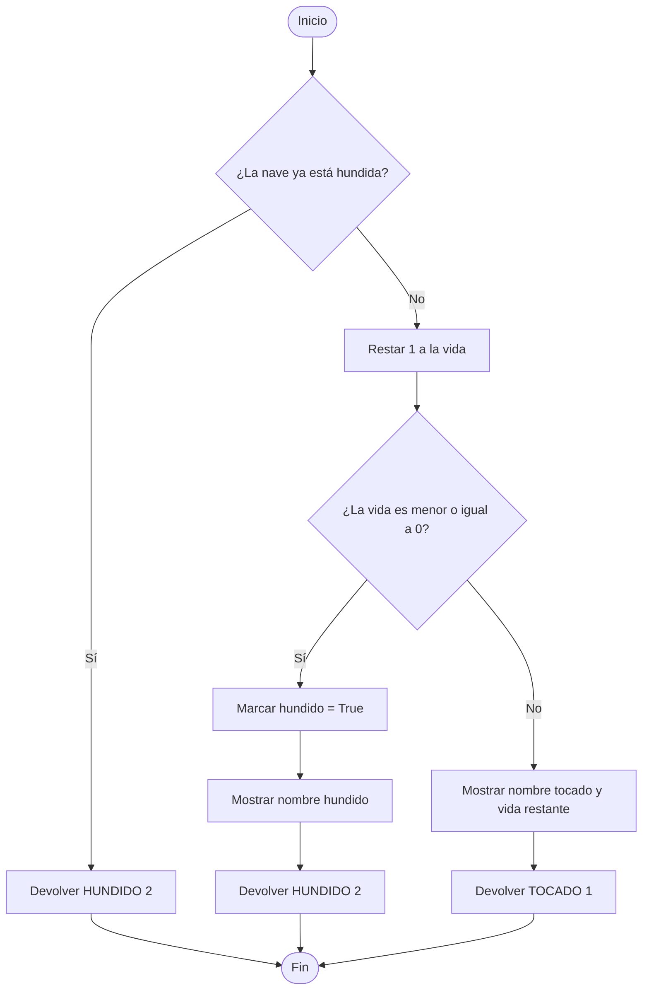
---
2. Clase `Casilla`
Método `recibir_disparo()`
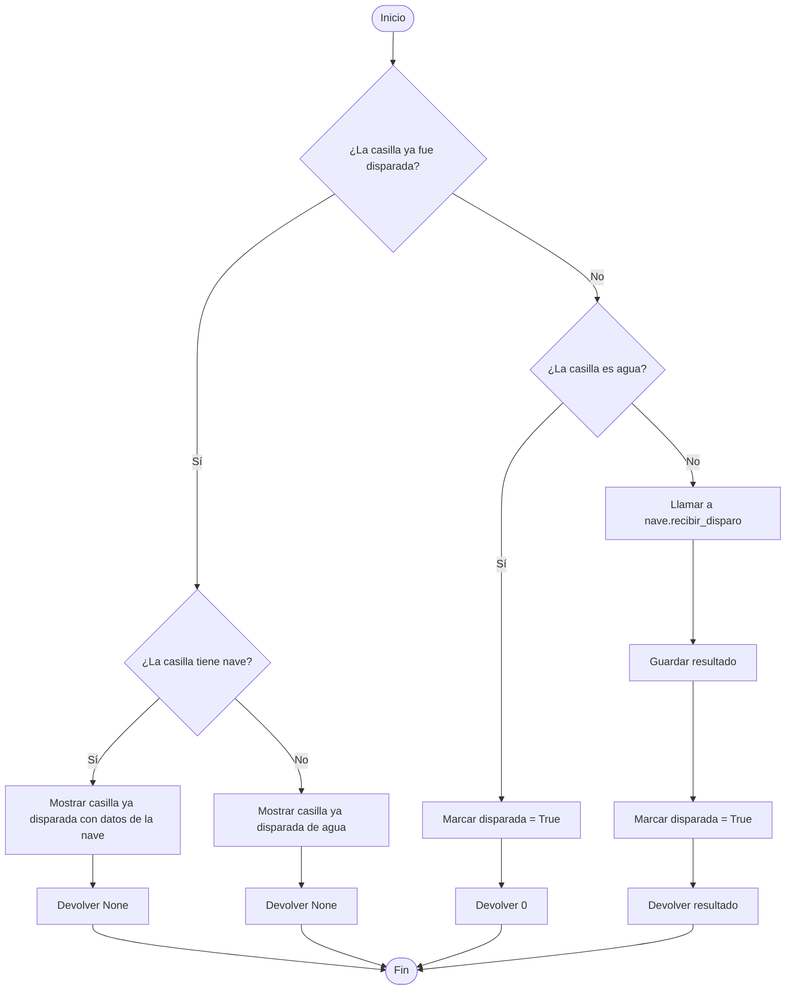
---
3. Clase `Tablero`
Constructor `__init__()`
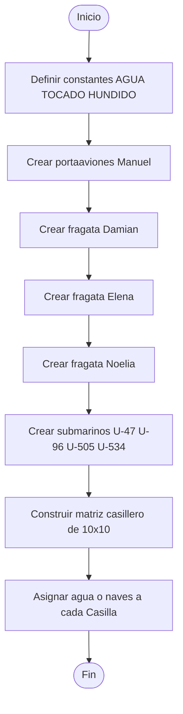
---
4. Clase `Jugador`
Constructor `__init__()`
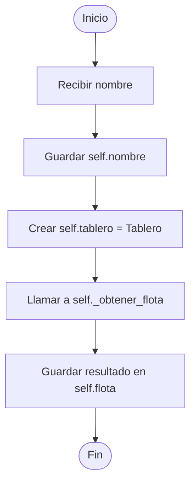
Método `_obtener_flota()`
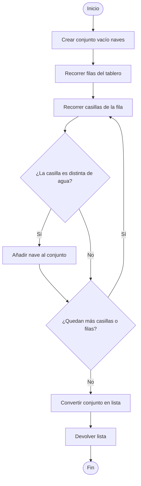
Método `ha_perdido()`
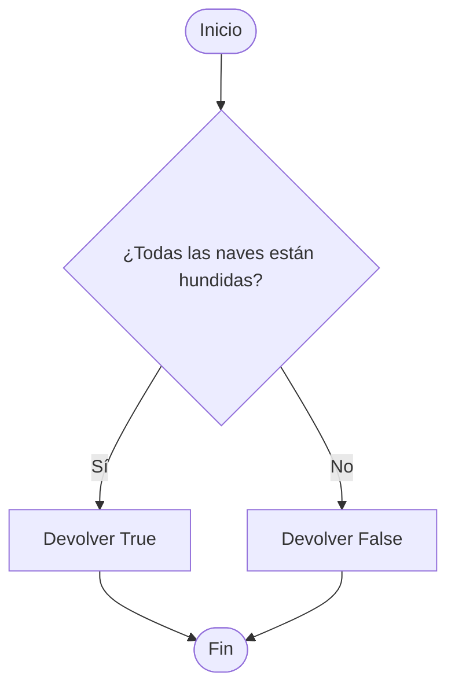
Método `mostrar_flota()`
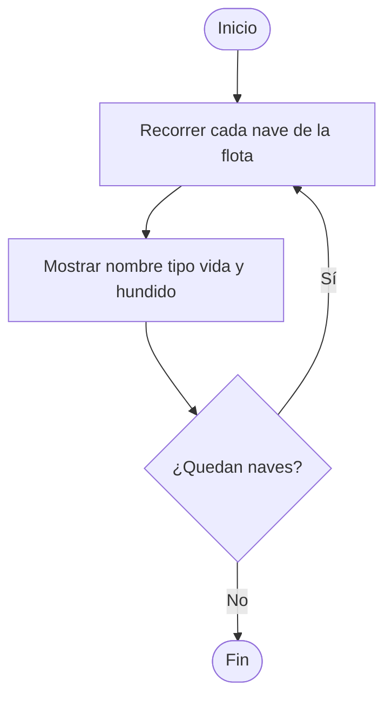
---
5. Clase `Flota`
Constructor `__init__()`
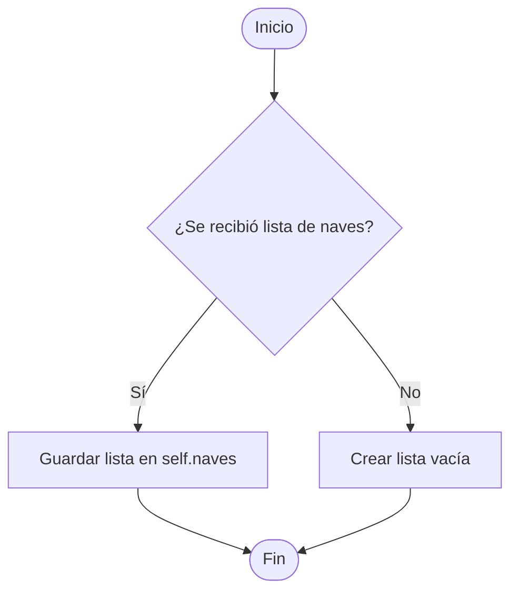
Método `agregar_nave()`
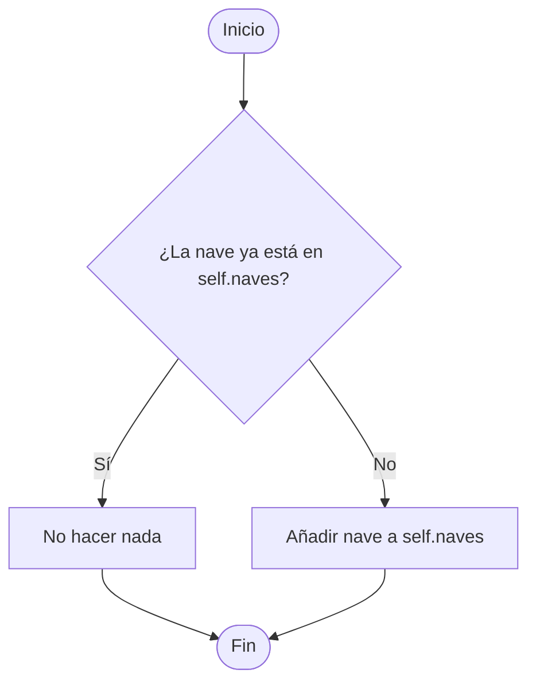
Método `todas_hundidas()`

Método `mostrar_estado()`
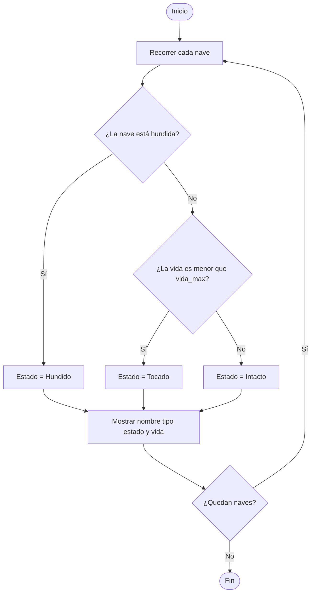
> Nota: en el código actual de `Nave` no existe `vida_max`, así que este flujo representa la lógica escrita en `Flota`, aunque ese método fallaría al ejecutarse si no se añade ese atributo.
---
6. Clase `Ataque`
Constructor `__init__()`
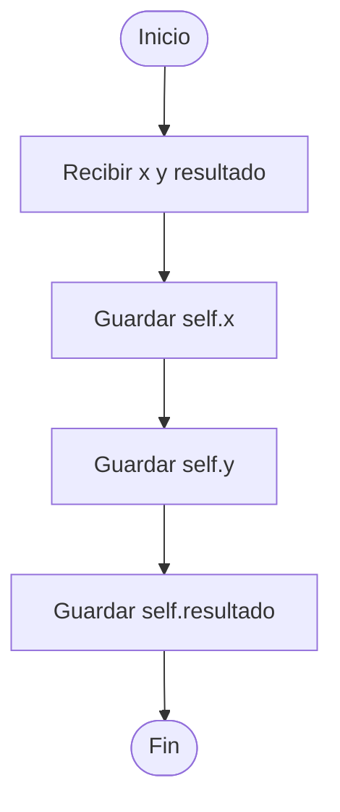
Método `__str__()`
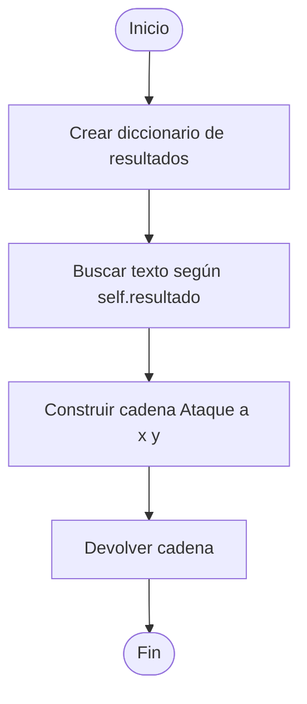
---
7. Clase `Juego`
Secuencia general de ataque
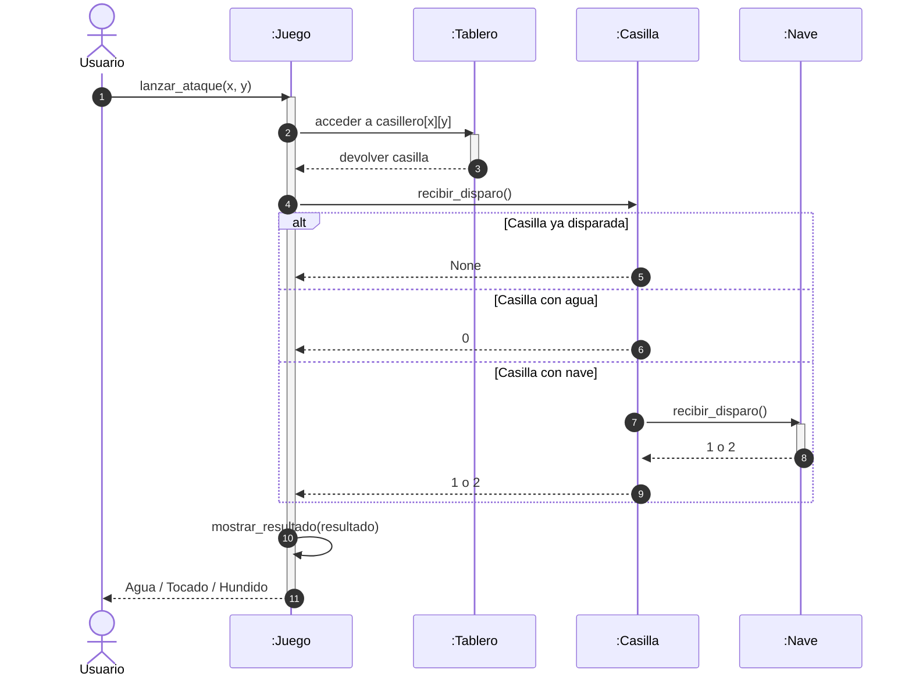
Método `mostrar_resultado(resultado)`
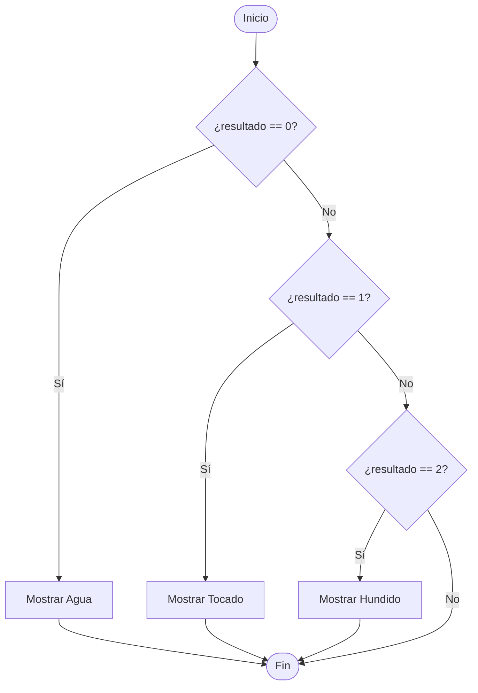
Método `lanzar_ataque(x, y)`
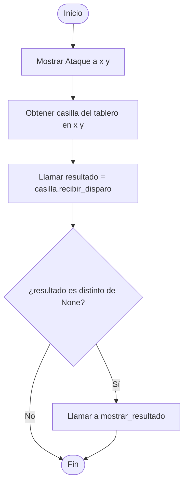
Constructor `__init__()`
```mermaid
flowchart TD
    A([Inicio]) --> B[Crear self.tablero = Tablero]
    B --> C[Lanzar ataque 1 0]
    C --> D[Lanzar ataque 1 0]
    D --> E[Lanzar ataque 1 1]
    E --> F[Lanzar ataque 1 2]
    F --> G[Lanzar ataque 2 1]
    G --> H[Lanzar ataque 1 4]
    H --> Z([Fin])
